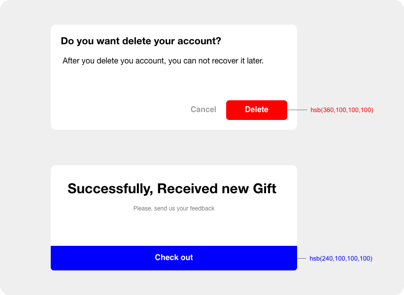
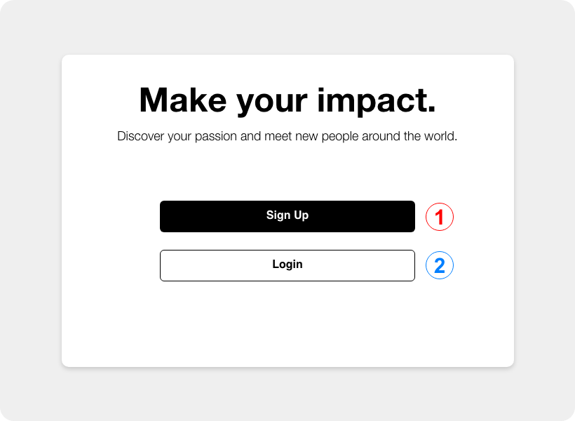

  
  <h2>Made for front-end developers</h2>
    <h4>Learn how to design awesome UIs by yourself using specific tactics explained from a developer's point-of-view.</h4>

##  

## :question: Why Sun UI?

<i> " I want to **develop** **modern**, **consistent**, **accessible** and **customizable** user interfaces such as Facebook UI, but **I don't know nothing** about the **design fundamentals and principles!** or the best workflow that let me code **static mockups and prototypes** and convert them to **beautiful and dynamic** UI in the browser with an **effective** way. How can I transform my awesome idea into real product without relying on a designer. How can I grasp knowledge about designing user interfaces without spending **long time in reading dozens of blogs and books**? How can I give a constructive feedback to our designer(s) about the current UI?" </i>

These are the frequent questions I ask myself when I develop the user interfaces using HTML, CSS, JS or a popular framework such React, Vue or Sevelte. If you're a **FRONT-END** developer, you may encountered these situations where you **struggle** to create a beautiful and universal user interfaces though your killer skills in programming.

Like a lot of developers, I always wished I could create beautifull web or mobile apps without relying on a designer, but any time I tried to design something myself I would always get frustrated and give up.

Most of the designers are visionary and creative people, while most of us (the programmers) are logical and analytical people. However, this is not an argument that prevent us from making powerful things that look better.

## :rocket: Mission

My mission through this project is to simplify the UI design for **FRONT-END** developers using specific tactics and practical tips explained from a developer's point-of-view.

## :bouquet: Value

Learn how to create consistent and modern user interfaces or improve the current one based on the TIPS I share here. I update this repository regularly with new PRO TIPS. I added illustrations to make the explanations more tangible. By reading these TIPS you'll be able to **create user intefaces with a designer mindset.**

---

<b>TIP 01: Use primary colors for primary actions</b>

Buttons should be the **first choice** when designing for action because that is what buttons are intended for and what users expect.

When a user interface prompts users to take action, they’ll see at least two buttons. One button is **primary** to the user’s task and the other is **secondary**. To make this distinction clear, you have to use **visual weight**.

The button with the strongest visual weight will get the most attention. It’s important that **primary actions** have the **strongest visual weight**. **Secondary actions** should have the **weakest visual weight.**

---

---

<b>TIP 02: Visually differentiate Primary and Secondary actions</b>

**The primary action** is an action that allows the user to accomplish their most **common or most important goal**.

**Secondary actions** are any actions that are less important. When in doubt, the default action is the primary one.

Be sure to give prominence to the primary action button by making the secondary action appear secondary, visually.

 

 

You'll notice on many Sign Up / Log In designs, the Sign Up button is always primary.

The reason is that if you've already signed up for an account, there is a good chance you'll be automatically signed-in. If not, you're familiar with the site and will know where to go to log in. That primary Sign Up button is there to direct all the new visitors to the site.

---
